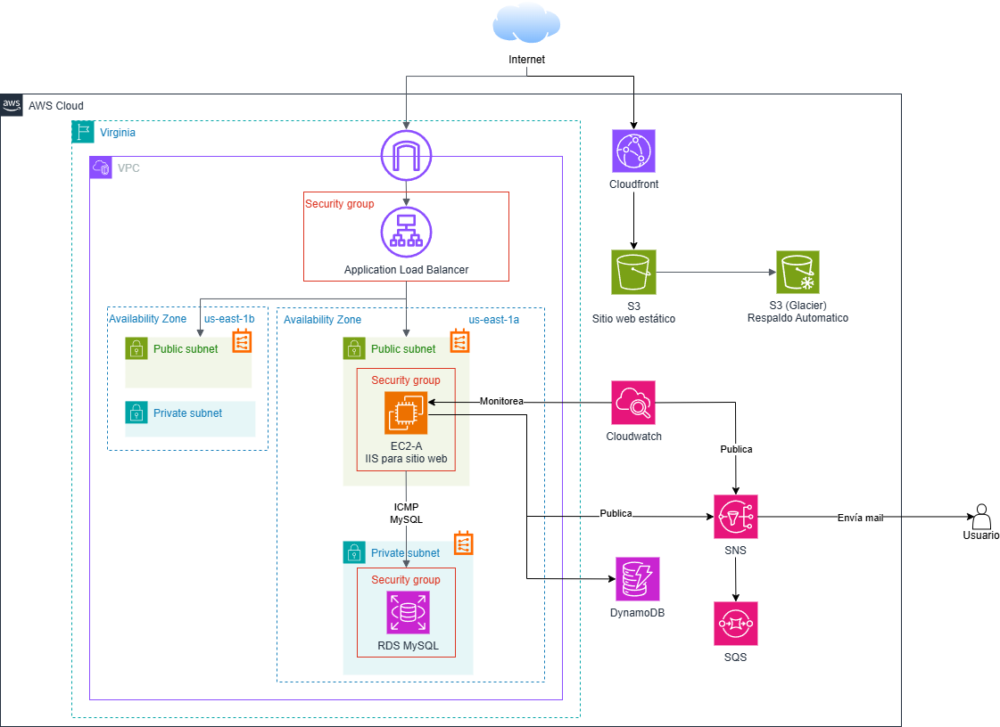

# Infraestructura Viva 🌐☁️

Este proyecto presenta una solución de migración de infraestructura on-premise a la nube utilizando servicios de AWS dentro de la capa gratuita y recursos de AWS Academy. La propuesta responde a necesidades de escalabilidad, disponibilidad, almacenamiento y monitoreo de la empresa ficticia "Soluciones Digitales ACME".



## 🧩 Arquitectura Implementada

- **Amazon S3 + CloudFront:** Hosting de sitio web estático con distribución global y replicación a Glacier.
- **VPC con subredes públicas y privadas en dos zonas de disponibilidad.**
- **EC2 con IIS:** Sitio web dinámico y conexión a RDS.
- **RDS MySQL:** Base de datos relacional accesible solo desde EC2.
- **DynamoDB:** Uso teórico para integración con EC2 mediante Python y boto3.
- **SNS + SQS + DLQ:** Notificaciones por correo y patrón de reintentos.
- **CloudWatch:** Métricas, alarmas y acción automática ante incidentes.

## Contenido

- **[Resumen del Proyecto y Guía de Buenas Prácticas](resumen-del-proyecto-y.guia-de-buenas-practicas.pdf)**: Documento PDF con descripción de la arquitectura y justificación técnica en conjunto con consideraciones de seguridad, escalabilidad y administración.
- **[Diagrama de Arquitectura](diagrama-arquitectura.png)**: Imagen representativa de la arquitectura desplegada.
- **[Implementación del Proyecto](implementación-proyecto.pdf)**: Documento PDF del paso a paso de la implementación del proyecto con capturas de pantalla de la consola y de las configuraciones realizadas.
- **Instrucciones de Implementación**: Implementación segmentada con archivos paso a paso para desplegar cada componente.
- **Scripts y Códigos**: Comandos usados en pruebas, ejemplo de uso con Boto3 y consultas SQL.
- **Evidencias**: Capturas de pantalla del entorno desplegado.

## 🛠️ Requisitos Previos

- Cuenta en [AWS Free Tier](https://aws.amazon.com/free/)
- Visual Studio Code (con extensiones como SQLTools)
- Python 3.x (si se quiere probar el código con boto3)

## 🚀 Despliegue

1. **Clona este repositorio:**

```bash
git clone https://github.com/tuusuario/infraestructura-viva.git
cd infraestructura-viva
```

## 📌 Consideraciones

- Este proyecto fue desarrollado con fines académicos.
- Algunos recursos como roles IAM no pudieron ser aplicados debido a restricciones de AWS Academy.
